# HTML, CSS Review

## How the Web Works

Let's watch a short video to recap [how the web works](https://www.youtube.com/watch?v=kBXQZMmiA4s)

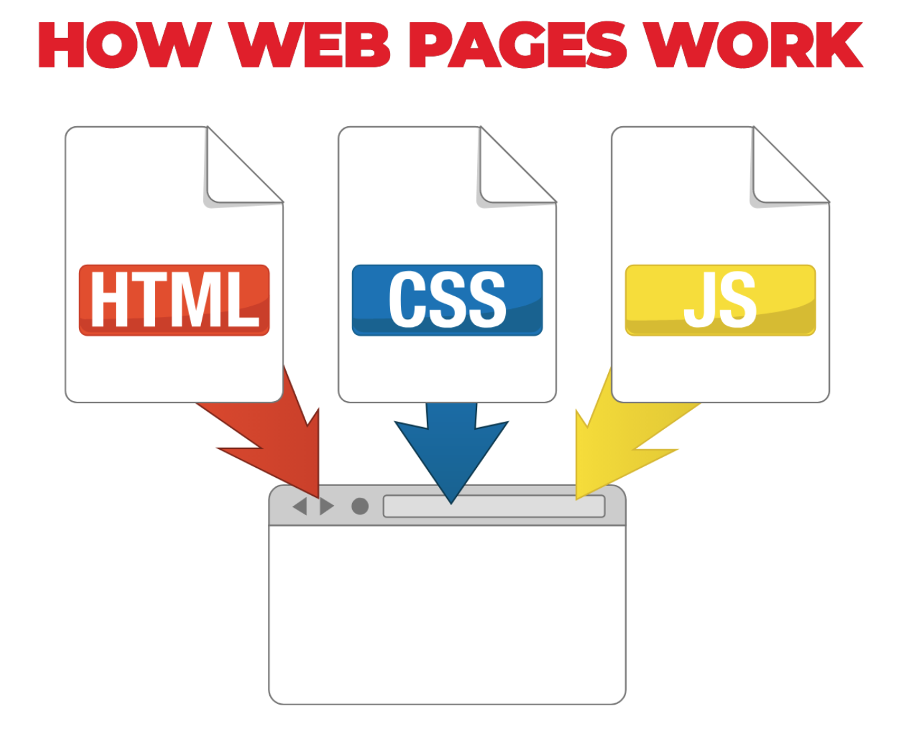

## HTML

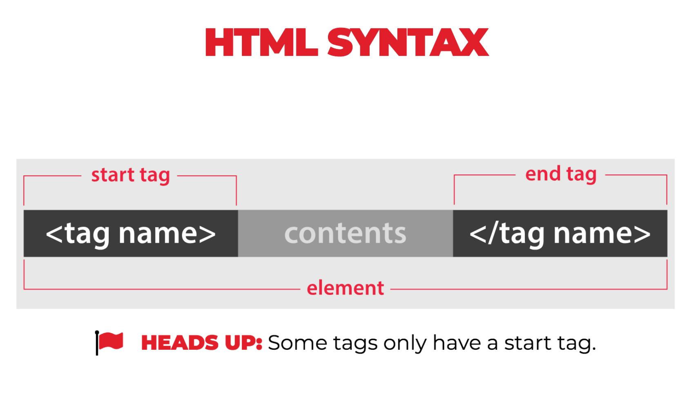

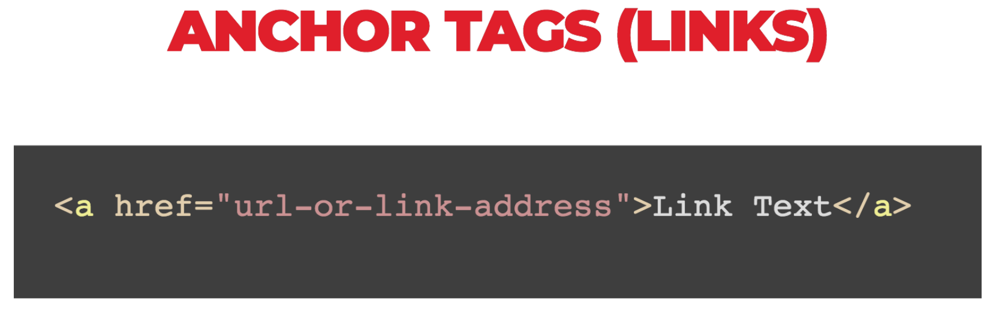

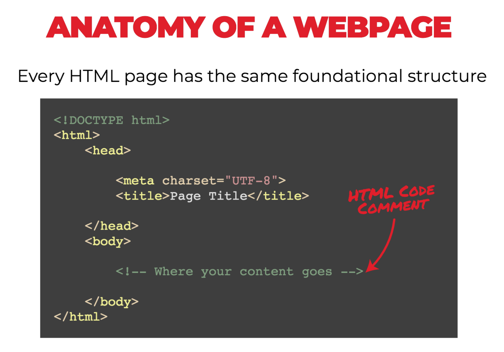

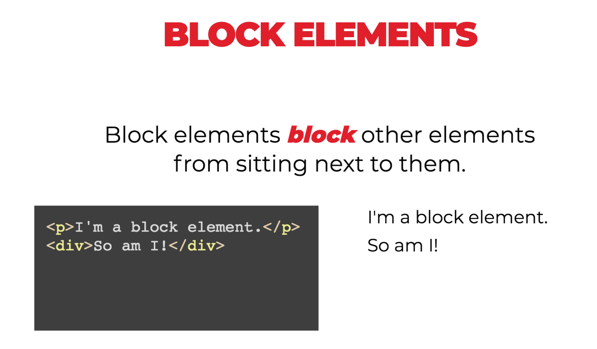

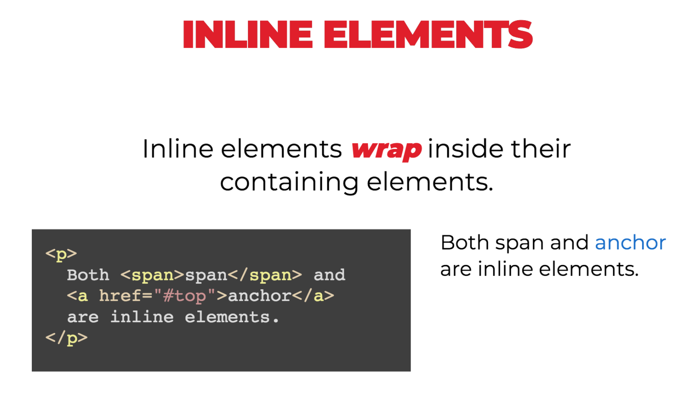

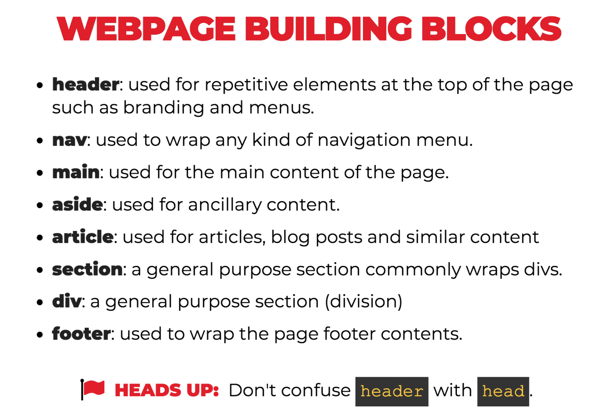

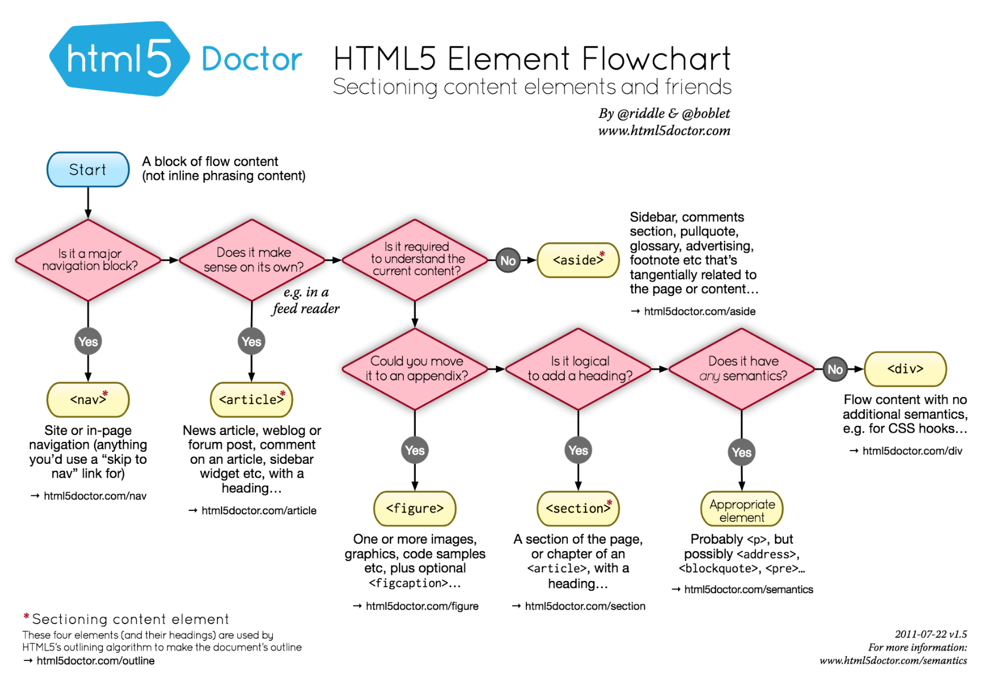

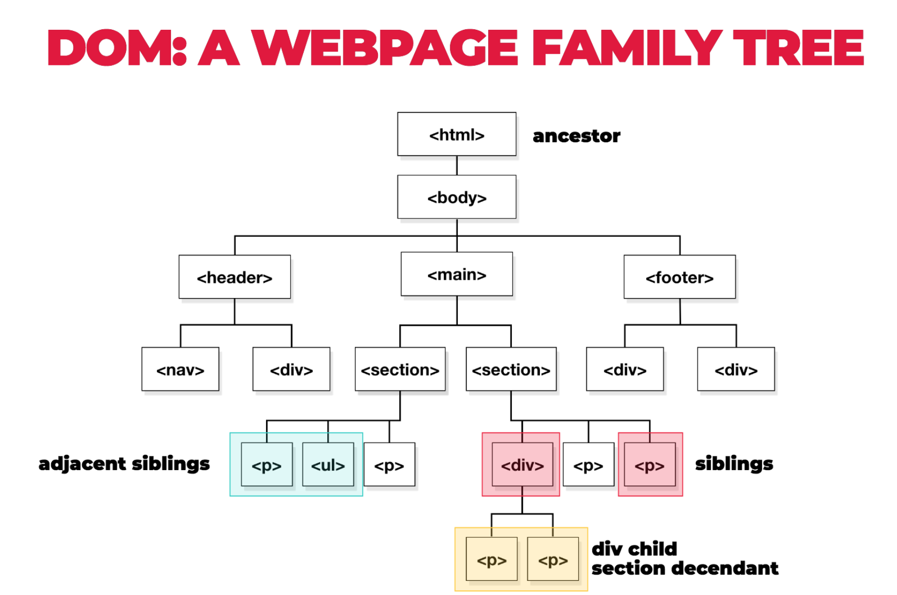

## CSS

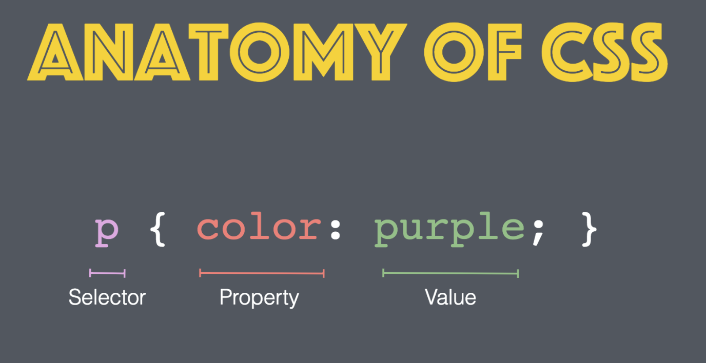

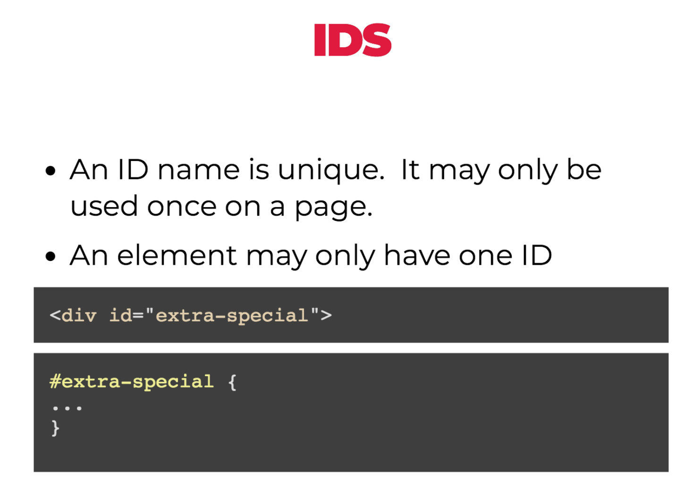

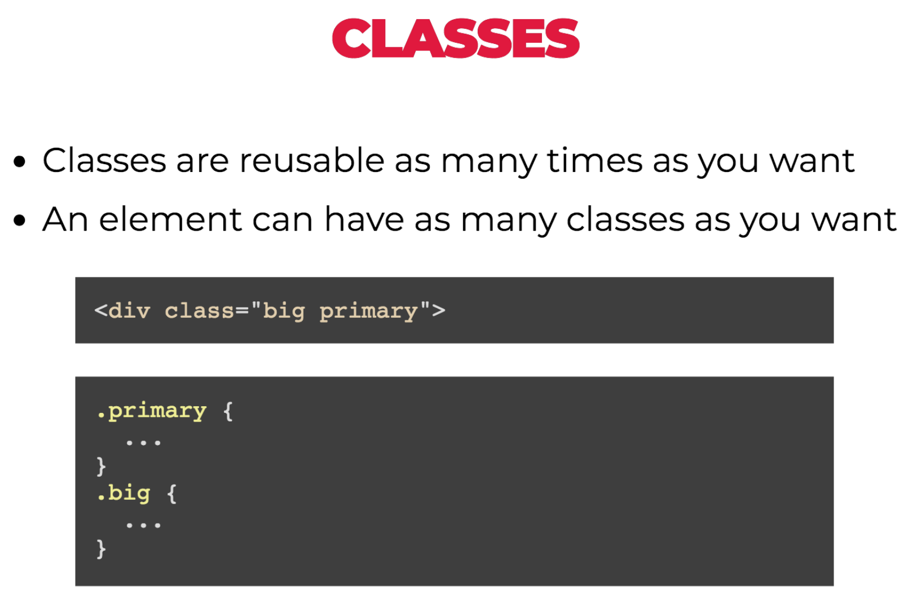

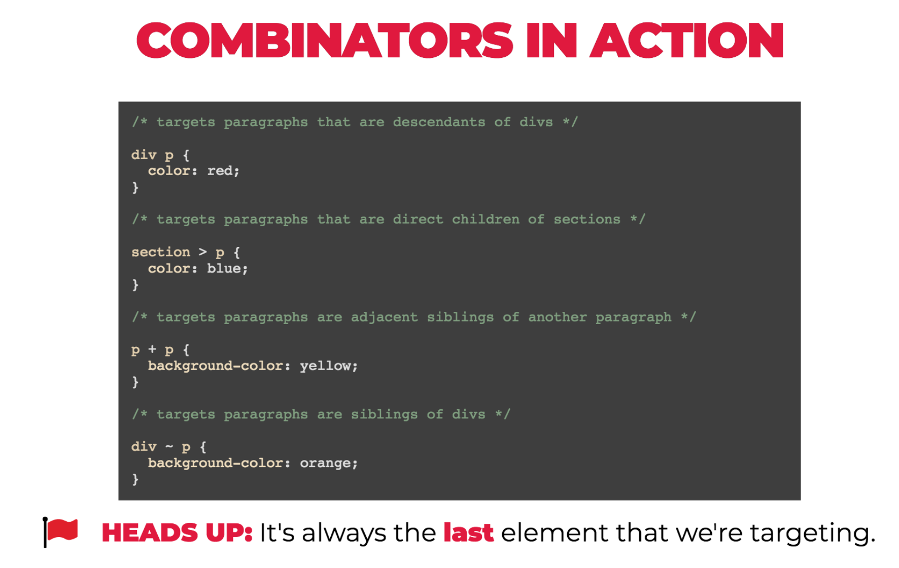

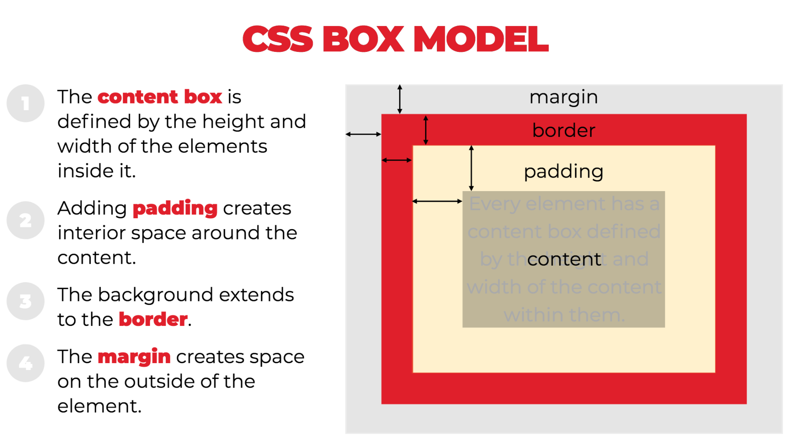

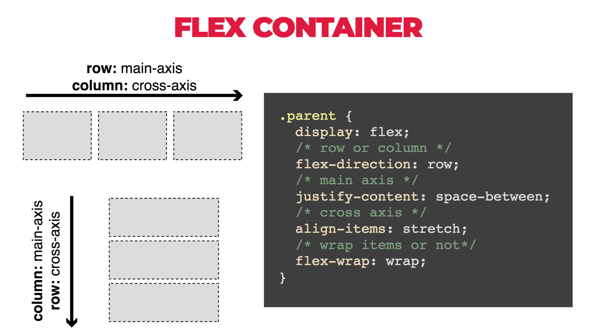

## Paths

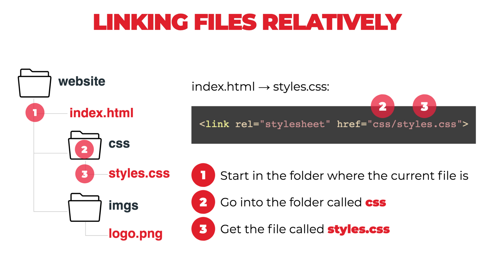

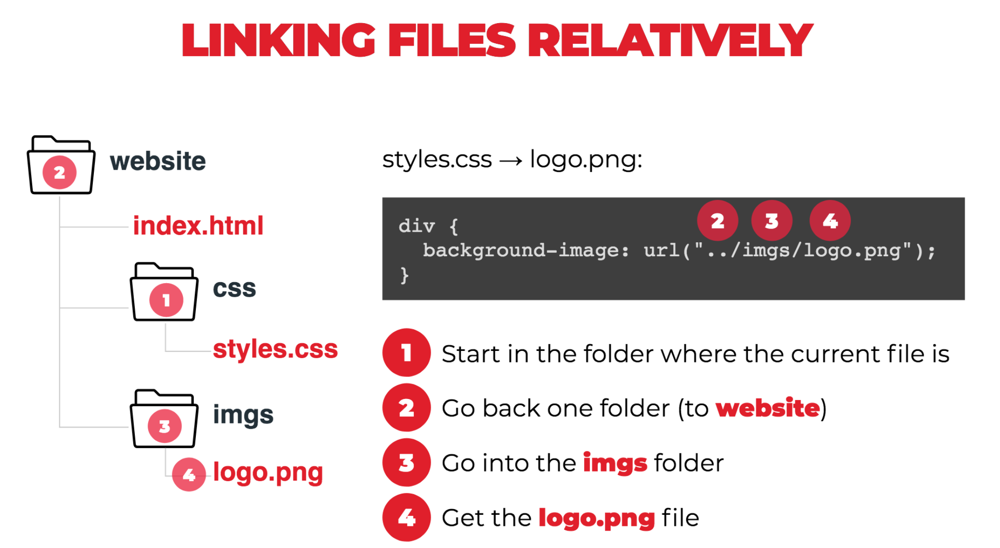

# HTML/CSS Practice

A hot, new NY Tech Startup, Relaxr, has approached you to help them develop a new landing page for their company. They've handed you the for the site, along with the copy and assets. You need to take these files and turn it into a landing page.

[Click here for more details about our Relaxr client's website!](exercise/README.md)